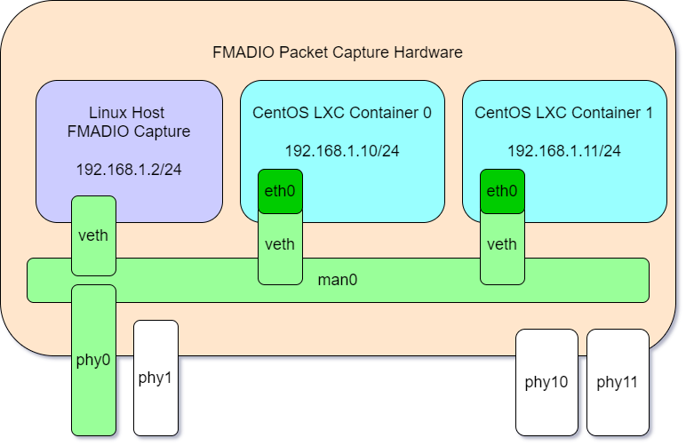

# CentOS 7 FMADIO LXC Container

Reference CentOS 7 FMADIO LXC Continer for use on FMADIO Packet Capture Systems.


## Config


The default static IP address is 192.168.1.10/24 Gateway:192.168.1.1 


LXC Config as follows

```
# Distribution configuration
lxc.include = /usr/share/lxc/config/centos.common.conf
lxc.arch = x86_64

# Container specific configuration
lxc.rootfs.path = dir:/opt/fmadio/lxc/lib/lxc/centos7/rootfs
lxc.uts.name = centos

# Network configuration
lxc.net.0.type = veth
lxc.net.0.link = man0
lxc.net.0.flags = up
lxc.net.0.ipv4.address = 192.168.1.10
lxc.net.0.ipv4.gateway = 192.168.1.1

# map passthru queue 
lxc.mount.entry = /opt/fmadio/queue/lxc_ring0 opt/fmadio/queue/lxc_ring0 none bind,create=file 0 0  
```

By default FMADIO uses bridged networking, this allows the container to look like a full linux system running off a different IP, even tho its running on the FMADIO hardware. Network topology is shown below





###Host System###

In the above diagram the FMADIO Packet Capture system running on as Host (baremetal) uses the virtual ethernet bridge "man0" with a static IP of 192.168.1.2/24 This interface is the general management used for FMADIO GUI, SSH etc to operate the core FMADIO Packet Capture System. 

## Container 0##

In additionm the above diagram has "CentOS LXC Container 0" which is a virtualized (Using LXC) CentOS image running on the FMAD Packet Capture Hardware. It also uses the virtual ethernet bridge "man0" for connectivity and has its ethernet interface configured for 192.168.1.10/24 

## Container 1##

Siliarly a 2nd "CentOS LXC Container 1" image is also running on the FMADIO Packet Capture Hardware, also using the virtual ethernet bridge "man0" with a static IP of 192.168.1.11/24 

All these interfaces utilize the "man0" virtual ethernet bridge, meaning while they share the same physical network interface "phy0" they all have unique and seperate IP addresse on the 192.168.1.0/24 network. From an external server it appears they are 3 seperate systems.


